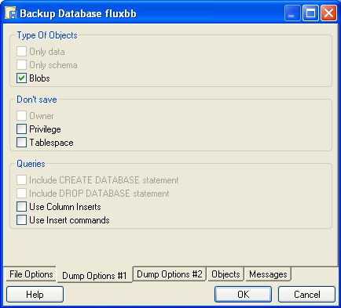
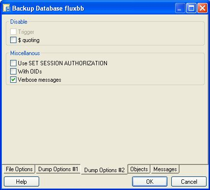
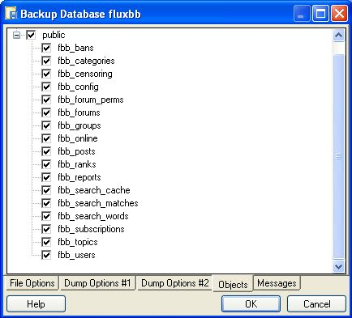
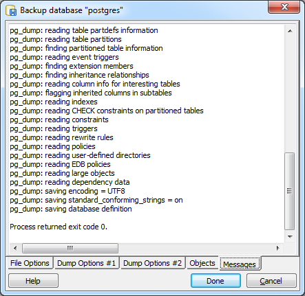

.. _backup:

***************
`Backup`:index:
***************

The *Backup* dialog provides an easy-to-use interface for the pg_dump `pg_dump <http://www.postgresql.org/docs/current/interactive/app-pgdump.html>`_ command line utility.  Easy to use options allow you to backup a database, a schema definition, data, or an database object.

By selecting fields on the *Backup* dialog, you specify which options should be included in a customized pg_dump command.  The pg_dump command writes an archive that you can use with the pgAdmin's :ref:`*Restore* <restore>` dialog, the `psql client <http://www.postgresql.org/docs/current/interactive/app-psql.html>`_ , or pg_restore to recreate the objects backed up by the archive. 

If you choose to create a plain-text backup, you can review the SQL commands that build the selected object to better help you understand how the object will be recreated.  You can also optionally modify the content to create new database objects before restoring.

**********************
Supported File Formats
**********************

The drop-down listbox in the *Format* field allows you to select an archive format.  Each format has advantages and disadvantages; select the format that is best suited for your application:

 * Select *Plain* to generate a plain-text script file containing SQL statements and commands that you can execute at the psql command line or with pg_dump to recreate the database objects and load the table data.  A plain-text backup file can easily be edited in a text editor if desired before restoring the database objects with the psql program.  Plain-text format is normally recommended for smaller databases.
 * Select *Custom* to generate a pg_dump formatted binary file that allows for restoration of all or only selected database objects from the backup file.  You can use pgAdmin to restore from a custom archive backup file.  A custom archive backup file cannot be edited, but you can use pgAdmin to select which database objects to restore from the backup file.  Custom archive format is recommended for medium to large databases from which you may want to select the database objects to restore from the backup file.
 * Select *Tar* to generate a tar archive file that allows for restoration of all or only selected database objects from the backup file.  You can use pgAdmin to restore from a tar archive backup file.
 * Select *Directory* to generate a directory-format archive suitable for use with pgAdmin's Restore dialog or  pg_restore.  This file format creates a directory with one file for each table and blob being dumped, plus a Table of Contents file describing the dumped objects in a machine-readable format that pg_restore can read.  A directory format archive can be manipulated with standard Unix tools; for example, files in an uncompressed archive can be compressed with the gzip tool.  This format is compressed by default and supports parallel dumps.

*****************
The Backup Dialog
*****************

To open the *Backup* dialog, right click on the name of a database or a named object in the tree control and select *Backup…* from the context menu.  The *Backup* dialog opens:

.. image:: images/backup.png

Use the fields on the *File Options* tab to specify general information about the backup.

* Enter the name of the backup file in the *Filename* field.  Optionally, use the browser button to navigate into a directory and select a file that will contain the archive.
* Use the drop-down listbox in the *Format* field to select the file format for the backup.
* Use the *Compress Ratio* field to select a compression level for the backup.  Specify a value of zero to mean use no compression; specify a maximum compression value of 9.  Please note that tar archives do not support compression.
* Use the *Encoding* drop-down listbox to select the encoding that should be used for the archive.
* Use the *Number of Jobs* field (when applicable) to specify the number of tables that will be dumped simultaneously in a parallel backup.  

When you've completed the *File Options* tab, navigate to the *Dump Options #1* tab:

Use the fields on the *Dump Options #1* tab to specify details about the type of objects that will be backed up:

* Use the checkboxes in the *Sections* box to select a portion of the object that will be backed up.  By default, a backup will include all sections.  
  
  * Check the box next to *Pre-data* to include all data definition items not included in the data or post-data item lists.
  * Check the box next to *Data* to backup actual table data, large-object contents, and sequence values. 
  * Check the box next to *Post-data* to include definitions of indexes, triggers, rules, and constraints other than validated check constraints. 

* Use the checkboxes in the *Type of Objects* box to select the objects that will be included in the backup.  By default, all objects will be included in the backup.

  * Check the box next to *Only data* to back up only the data.
  * Check the box next to *Only schema* to back up only the schema (the data definitions). 
  * Check the box next to *Blobs* to include large objects in the backup. 

* Use the checkboxes in the *Don't Save* box to select the objects that will not be included in the backup.

  * Check the box next to *Owner* to omit commands that set object ownership.
  * Check the box next to *Privilege* to omit commands that create access privileges. 
  * Check the box next to *Tablespace* to omit tablespaces. 
  * Check the box next to *Unlogged* table data to omit the contents of unlogged tables. 

When you've completed the *Dump Options #1* tab, select the *Dump Options #2* tab:

Use the fields on the *Dump Options #2* tab to specify details about the statements used within the backup file.

* Use the checkboxes in the *Queries* box to specify the type of statements that should be included in the backup.

  * Check the box next to *Include CREATE DATABASE* statement to include a command in the backup that creates a new database when restoring from the backup.
  * Check the box next to *Include DROP DATABASE* statement to include a command in the backup that drops any existing database before restoring from the backup.
  * Check the box next to *Use Column Inserts* to dump the data in the form of INSERT statements, with explicit column names.  Please note: this may make restoration from backup slow.
  * Check the box next to *Use Insert commands* to dump the data in the form of INSERT statements rather than using a COPY command.  Please note: this may make restoration from backup slow.

* Use the checkboxes in the *Disable* box to specify the type of statements that should be excluded from the backup.

  * Check the box next to *Trigger* (active when creating a data-only backup) to include commands that will disable triggers on the target table while the data is being loaded.
  * Check the box next to *$ quoting* to disable dollar quoting within function bodies; if disabled, the function body will be quoted using SQL standard string syntax.

* Use the checkboxes in the *Miscellaneous* box to specify miscellaneous backup options.

  * Check the box next to *Use SET SESSION AUTHORIZATION* to include a statement that will use a SET SESSION AUTHORIZATION command to determine object ownership (instead of an ALTER OWNER command).
  * Check the box next to *With OIDs* to include object identifiers as part of the table data for each table.
  * Check the box next to *Verbose messages* to instruct pg_dump to use verbose messages.
  * Check the box next to *Force double quotes on identifiers* to force the quoting of all identifiers.
  
When you've completed the *Dump Options #2* tab, select the *Objects* tab:

Use the fields on the *Objects* tab to select the objects that will be included in the backup; by default, when performing a database backup, all objects will be selected for inclusion in the archive.  Deselect an object name to exclude that object from the archive.

When you've specified the details that will be incorporated into the pg_dump command, click the *Backup* button to build and execute a command based on those preferences; the result will be displayed on the *Messages* tab:

If the backup is successful, the *Messages* tab will display:

	*Process returned exit code 0.*
	
Scroll up to review the pg_dump command used to generate the archive, or to view any error messages that were returned during the backup.   When you're finished, click *Done* to exit the *Backup* dialog.

