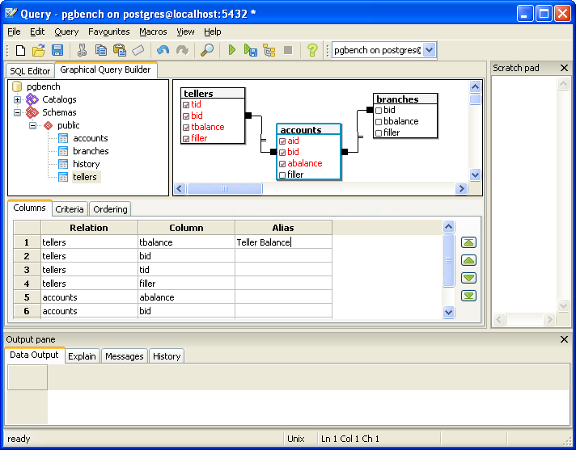

.. _gqb:

********************************
`Graphical Query builder`:index:
********************************

The Graphical Query Builder (GQB) is part of the :ref:`Query Tool <gqb>`
which allows you to build simple SQL queries visually.

There are three main parts of the GQB. The relation browser on the left
hand side allows you to select catalogs, classes and views to include in 
your queries. Along the bottom are a set of tabs which allow you to specify
selection criteria, output format and sorting. The third section is the 
canvas on which you draw the relationships between the relations in your
tables. You can adjust the relative size of each section by dragging the
join (or sash) between the panes.

To add relations to the query, either double click them in the relation
browser, or drag them from the browser onto the canvas. You can arrange relations
on the canvas by selecting the relation name with the mouse and moving the relation
to the desired position.

To create joins between relations, drag a column from one relation onto 
another. A line will be drawn between them to indicate the join. Right-clicking
the join will present a popup menu from where you can select the join operator
or delete it.

To select the columns that will appear in the query results, check the desired
columns within the relation on the canvas. Each column selected will be added to
the list on the Columns tab on which you can adjust the ordering, and specify
column aliases.

To specify selection criteria, add rows to the grid on the Criteria tab. The
restricted value can be set to a column name, or a constant value. The Operator 
column allows you to select a simple operator to be used to compare the restricted 
value with the value specified in the Value column. The Connector specifies how
the criteria will be joined to the next (if any).

The query results may be ordered on the Ordering tab. Select the columns
required on the left, and use the buttons in the middle to add them to the
ordering list on the right. You can also remove columns in the same way. 
For each column added to the ordering list, you can specify the sorting
direction. You can also adjust the priority of each ordering column by
selecting it, and moving it up or down the list using the buttons on the 
right.

When you have designed your query, you can use the Execute, Execute to File,
or Explain options on the toobar (and Query menu) to generate and execute the 
query.
