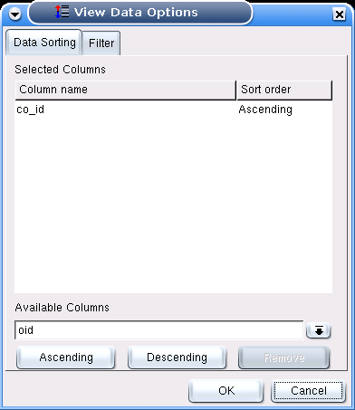
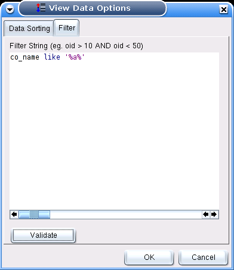

.. _gridopts:

**************************
`View Data Options`:index:
**************************

When "Apply Filter and View Data" is selected from the main menu,
or the "Sort/Filter" toolbar button is pressed in the data viewer,
this dialogue appears. It allows changing the sort order of the data,
and applying a filter to narrow the displayed data.

You can select one or more columns and the sort direction which should
be used to retrieve the data from the database.

You can enter an arbitrary WHERE clause, to restrict the result set
which is retrieved from the database. You can click "Validate" to have
pgAdmin III test whether the WHERE clause is valid.
