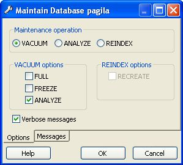

.. _maintenance:

***********************************
`Maintain a database object`:index:
***********************************

This tool allows to maintain the database in total, or only a
selected table, or a selected index.

Maintenance comes in three flavors.

VACUUM
======

VACUUM will scan the database or table for rows, that are not in
use any more. If a row is updated or deleted, the previous content
isn't replaced, but rather marked invalid. The new data is inserted
freshly into the database. You need to perform a garbage collection
regularly, to insure that your database doesn't contain too much
unused data, wasting disk space and ultimately degrading
performance.

Please press the Help button to see the PostgreSQL help about the
VACUUM command to learn more about the options.

The output of the database server is displayed in the messages
page as they arrive. If Verbose is selected, the server will send
very detailed info about what it did.

While this tool is very handy for ad-hoc maintenance purposes,
you are encouraged to install an automatic job, that performs a
VACUUM job regularly to keep your database in a neat state.

ANALYZE
=======

ANALYZE investigates statistical values about the selected
database or table. This enables the query optimizer to select the
fastest query plan, to give optimal performance. Every time your data
is changing radically, you should perform this task. It can be
included in a VACUUM run, using the appropriate option.

REINDEX
=======

REINDEX rebuilds the indexes in case these have degenerated caused 
by unusual data patterns inserted. This can happen for example if you insert
many rows with increasing index values, and delete low index values.

The RECREATE option doesn't call the REINDEX SQL command internally, 
instead it drops the existing table and recreates it according to the current index 
definition.This doesn't lock the table exclusively, as REINDEX does, but will lock 
write access only. 

