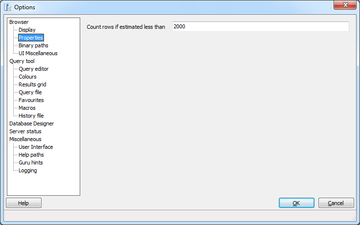
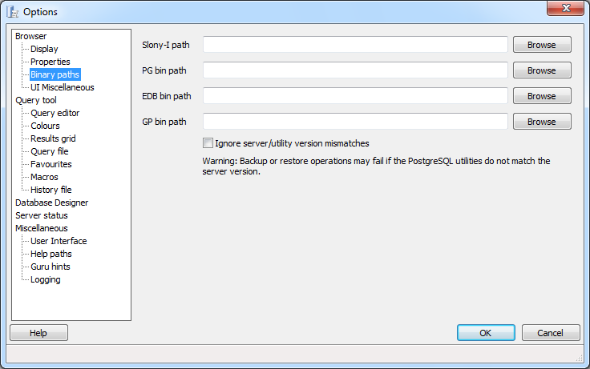
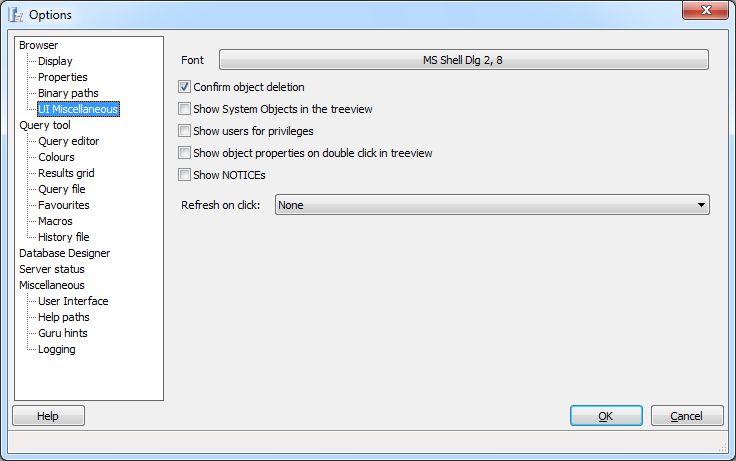

.. _options-browser:

***************************************************************
`pgAdmin Browser Options`:index:
***************************************************************

Use the options that are located under the *Browser* node of the tree control to personalize your workspace.  

.. image:: images/options-display.png

Use the options on the *Display* dialog to specify general display preferences:

* **Display the following database objects** - Check the box next to a database object type to instruct pgAdmin to display the selected object type in the pgAdmin tree control.  By default, pgAdmin displays only the most commonly used object types. 

* **Default** - You can reduce the number of object types displayed to increase the speed of pgAdmin when querying the system catalogs. Use the *Default* button to reset the list to its default settings.

Use the options on the *Properties* dialog to specify display properties:

* **Count rows if estimated less than** - Include a value in the *Count rows if estimated less than* field to perform a SELECT count(*) if the estimated number of rows in a table (as read from the table statistics) is below the specified limit.  After performing the SELECT count(*), pgAdmin will display the row count.

Use the options on the *Binary paths* dialog to specify binary file locations:

* **Slony-I path** - To enable pgAdmin to create Slony-I replication clusters from scratch, you must provide the path to the Slony-I script installation directory in this field. If no valid scripts can be found, you will only be allowed to join existing clusters.

* **PG bin path** - Use this field to specify the path to the standard PostgreSQL pg_dump, pg_restore and pg_dumpall utilities. pgAdmin will use these utilities when backing up and restoring your PostgreSQL databases. If this path is not set, pgAdmin will attempt to locate the utilities in its installation directory, the 'hint' directory set by a local PostgreSQL installation (on Windows) and in the system path.

* **EDB bin path** - Use this field to specify the path to the EnterpriseDB pg_dump, pg_restore and pg_dumpall utilities. pgAdmin will use these utilities when backing up and restoring your EnterpriseDB databases. If this path is not set, pgAdmin will attempt to find the utilities in standard locations used by EnterpriseDB.

* **GP bin path** - Use this field to specify the path to the Greenplum pg_dump, pg_restore and pg_dumpall utilities. pgAdmin will use these utilities when backing up and restoring your Greenplum databases. If this path is not set, pgAdmin will attempt to find the utilities in standard locations used by Greenplum.

Use the options on the *UI Miscellaneous* dialog to specify miscellaneous pgAdmin preferences:

* **Font** - Use the *Font* selector to specify the font used as the standard font throughout pgAdmin's main user interface. This may be useful for countries with multibyte character sets (where standard fonts may not display well), or if you wish to use a font different from the one configured on your system. 

* **Confirm object deletion** - Select this option to instruct pgAdmin to require confirmation before deleting an object (recommended). 
  
* **Show System Objects in the treeview** - Check the box next to *Show System Objects in the treeview* to instruct pgAdmin to display objects such as system schemas (e.g. pg_temp*) and system columns (e.g. xmin, ctid) in the tree control.
  
* **Show users for privileges** - Select this option to include usernames as well as groups in the subject list when viewing the *Privileges* tab of an object that supports privileges. Disabling this option is useful on large systems with many users that are organised in groups.

* **Show object properties on double click in treeview** - Select this option to specify that double clicking an object in the treeview should open the *Properties* dialogue for that object. Disable this option to browse the treeview using a double-click. 
     
* **Show NOTICEs** - Check the box next to *Show NOTICEs to* instruct pgAdmin to display notices from the server.

* **Refresh on click** - Use the *Refresh on click* drop-down listbox to specify that the displayed properties of the selected objects should be updated in the tree control when the object is selected.  Select from: 

   *  *None* to update no objects. 

   *  *Refresh object on click* to refresh the selected object. 

   *  *Refresh object and children on click* to refresh the selected object, and any objects that reside under the selected object in the tree control.

