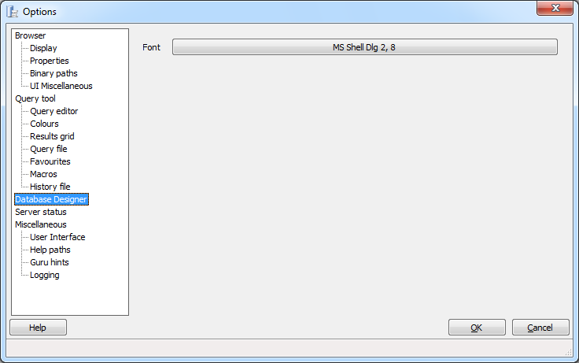

.. _options-database_designer:

***************************************************************
`pgAdmin Database Designer Options`:index:
***************************************************************

Use the options that are located under the *Database Designer* node of the tree control to specify options for the Database Designer tool.

* **Font** - Open the font selector to specify the fonts displayed within the Database Designer graphical interface.

