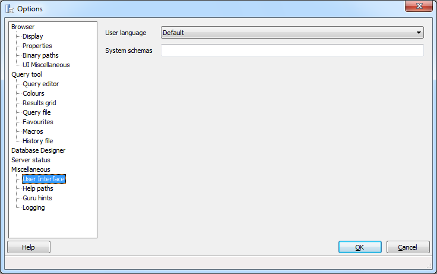
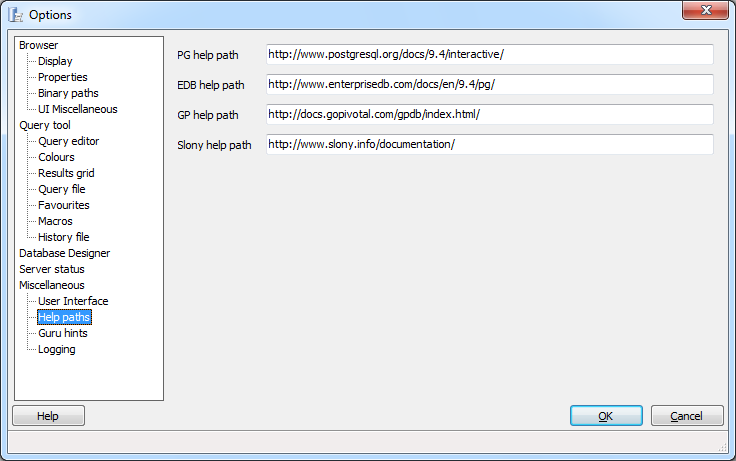
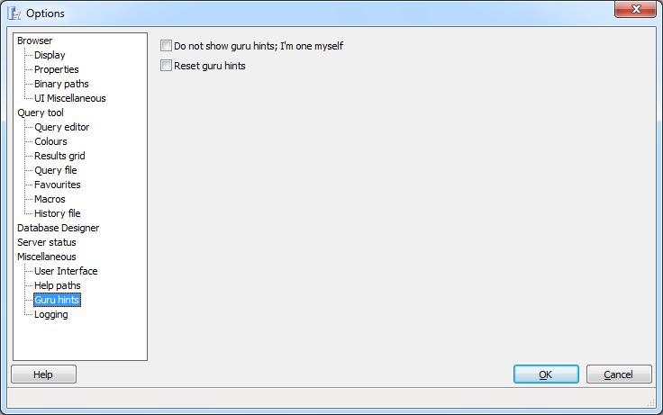
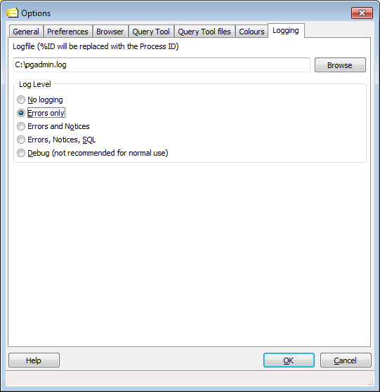

.. _options-miscellaneous:

***************************************************************
`pgAdmin Miscellaneous Options`:index:
***************************************************************

Use the options that are located under the *Miscellaneous* node of the tree control to personalize the behavior of your workspace.

Use the fields on the *User Interface* dialog to specify user interface preferences: 

* **User language** - Use the *User language* drop-down listbox to select the language displayed in the pgAdmin user interface.

* **System schemas** - pgAdmin will consider any schema (or schemas) listed in the *System schemas* field to be a system schema. To specify that a schema is a system schema, include the schema name in a list of comma-separated strings in the *System schemas* field.

Use the fields on the *Help paths* dialog to specify the locations of help files.  The path specified may be a URL or directory containing the HTML format help files (note that some browsers may require  file:///path/to/local/files/ notation, while others require /path/to/local/files/ notation), or the path to a Compiled HTML Help (.chm) file (on Windows), an HTML Help project (.hhp) file, or a Zip archive containing the HTML files and the HTML Help project file.

* **PG help path** - Use the *PG help path* field to specify the path to the PostgreSQL help files.  PostgreSQL Help files are displayed when *PostgreSQL HELP* is selected from the *Help* menu, or when accessing the help files through many database objects on PostgreSQL servers.

* **EDB help path** - Use the *EDB help path* option to specify the path to the EnterpriseDB help files. EnterpriseDB Help files are displayed when *EnterpriseDB Help* is selected from the *Help* menu, or when accessing the help files through many database objects on EnterpriseDB servers.

* **GP help path** - Use the *GP help path* option to specify the path to the Greenplum help files. Greenplum Help files are displayed when *Greenplum Database Help* is selected from the *Help* menu, or when accessing the help files through many database objects on Greenplum servers.

* **Slony help path** - Use the *Slony help path* option to specify the path to the Slony help files. Slony Help files are displayed when *Slony Help* is selected from the *Help* menu.

By default, if pgAdmin suspects you might need support, it displays a guru hint window.  Use the fields on the *Guru hints* dialog to suppress or display guru hints:

* **Do not show guru hints; I'm one myself** - Check the box next to *Do not show guru hints; I'm one myself* to suppress this behaviour. 

* **Reset guru hints** - Check the box next to *Reset guru hints* to instruct pgAdmin to display all guru hints until suppressed again.  

Use the fields on the *Logging* dialog to specify the location and content of pgAdmin log files:

* **Logfile** - Select this option to specify the name of the file in which pgAdmin will store any logging data.  If you include %ID in the specified file name, it will be replaced with the process ID, allowing multiple instances of pgAdmin to run with logging to individual files.
 
* **No logging** - No logging will be performed at all. 
 
* **Errors only** - pgAdmin will log errors to the log file, but nothing else.

* **Errors and Notices** - pgAdmin will log errors and notice messages from PostgreSQL to the log file, but nothing else.
 
* **Errors, Notices, SQL** - Error messages, notice messages from PostgreSQL and SQL queries will be logged to the log file.
  
* **Debug** - Error messages, notice messages from PostgreSQL, SQL queries and debug messages will be logged to the log file. This option may significantly slow down pgAdmin, and is therefore **not recommended for normal use**.

