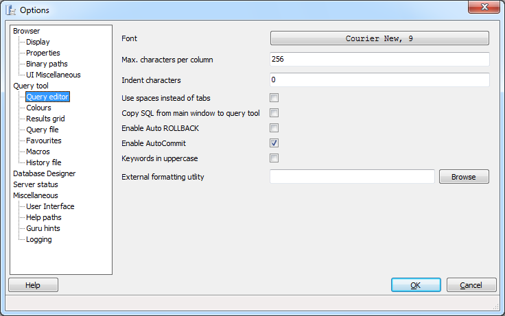
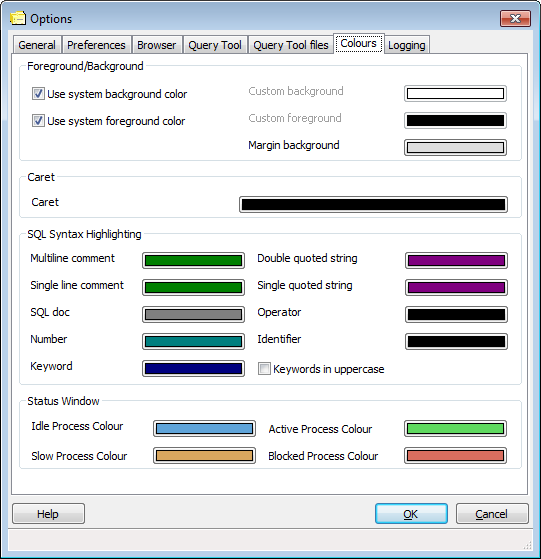
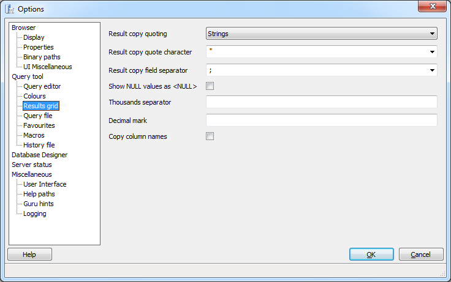
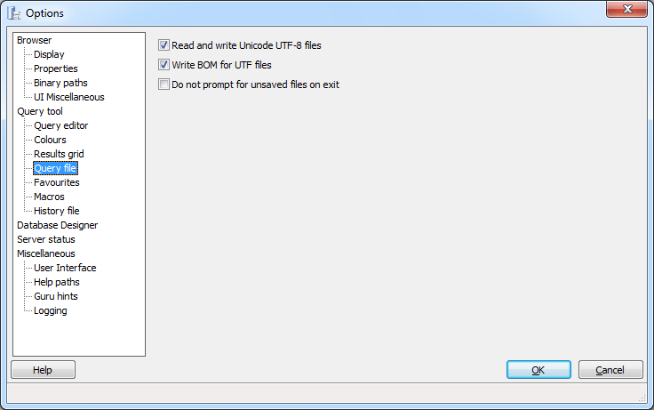
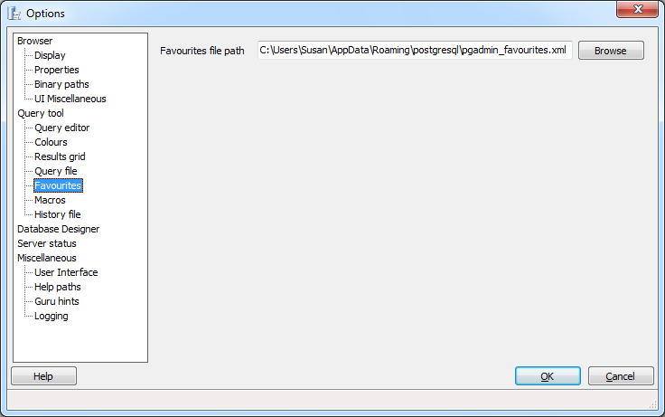
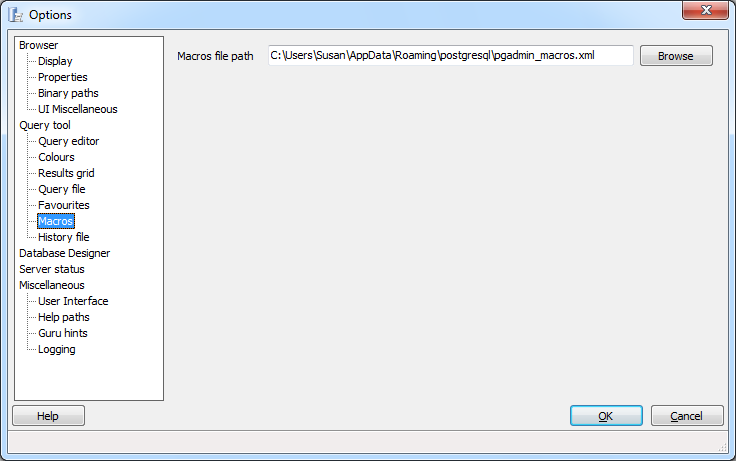
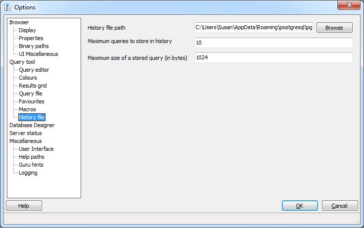

.. _options-query_tool:

***************************************************************
`pgAdmin Query tool Options`:index:
***************************************************************

Use the options that are located under the *Query tool* node of the tree control to personalize the behavior of the Query tool.

Use the fields on the *Query editor* dialog to specify workspace preferences for the Query editor:

* **Font** - Use the *Font* selector to specify the font used in the Query tool interface. 

* **Max characters per column** - Use the *Max characters per column* field to specify the maximum length of data displayed in a single column. 

* **Indent characters** - Use the *Indent* characters field to specify the number of characters to indent with in SQL text boxes.
 
* **Use spaces instead of tabs** - Check the box next to *Use spaces instead of tabs* to instruct pgAdmin to insert a space when you press the tab key in an SQL text box.

* **Copy SQL from main window to SQL dialogue** - Check the box next to *Copy SQL from main window to SQL dialogue* to instruct pgAdmin to copy any object definition displayed on the main object browser for use as a default query in the Query Tool when the Query Tool opens.

* **Enable Auto ROLLBACK** - Check the box next to *Enable Auto ROLLBACK* to instruct the query tool to execute a ROLLBACK if a query fails.

* **Enable Auto COMMIT** - Check the box next to *Enable Auto COMMIT* to instruct the query tool to enable auto commit after executing the query.

* **Keywords in uppercase** - Check the box next to *Keywords in uppercase* to instruct the Query tool to convert any keywords entered to an uppercase font.

* **External formatting utility** - Use the *External formatting utility* field to provide the name of a formatting tool that can be used to make queries more readable.  Use of a tool that provides support for UTF-8 multi-byte characters is not required, but is preferable.    The utility must:

  * Accept a STDIN stream and write the result set to STDOUT
  * Provide a result in less than 3 seconds
  * Exit with a code 0 on success

  To use an external formatting tool in the Query Editor:

  * Provide the name of the formatting tool in the *External formatting utility* field of the *Options* dialogue.
  * In the Query Editor, select a block of text for formatting, and Press Ctrl+Shift+f, or navigate through the *Edit* menu to the *Format* menu, and select *External Format*.

Use the fields displayed on the *Colours* dialog to select colours for items displayed in the Query tool:

* **Foreground/Background** - Use the color selectors in the **Foreground/Background** box to specify background and foreground colors for the Query tool.

* **Caret** - Use the color selector in the **Caret** box to specify a color for the caret (or cursor).

* **SQL Syntax Highlighting** - Use the color selectors in the **SQL Syntax Highlighting** box to specify display colors for syntax components.

Use the fields on the *Results Grid* dialog to specify display preferences for the results grid.

* **Result copy quoting** - Use the *Result copy quoting* drop-down listbox to specify how fields in a result set should be quoted when copied to the clipboard from the result list.  **Please Note** Disabling this option may prevent copying and pasting rows in the edit grid from functioning properly if the result set contains special characters like line breaks.  Specify:

   *  *None* to omit quotes when copied. 

   *  *Strings* to quote string values when copied (numeric columns will not be quoted). 

   *  *All* to quote all copied values (regardless of data type).

* **Result copy quote character** - Use the *Result copy quote character* drop-down listbox to select a character that will be used to quote the values when copied to the clipboard from the result list. It has no effect if *Result copy quoting* is set to *None*.

* **Result copy field separator** - Use the *Result copy field separator* drop-down listbox to select a character that will be used to separate the fields copied to the clipboard from the result list.  

* **Show NULL values as <NULL>** - Check the box next to *Show NULL values as <NULL>* to cause NULL values to be shown as <NULL> in the Query Tool's results grid. Note that this option does not affect data that is exported from the grid, only what is displayed.

* **Thousands separator** - Use the *Thousands separator* field to specify a delimiter character that will be used to break a value into groups of three digits, counting left from the decimal mark.

* **Decimal mark** - Use the *Decimal mark* field to specify a delimiter character that will be used to break a number into an integer portion and a fractional portion.

* **Copy column names** - Check the box next to *Copy column names* to specify that when copying from the result grid, the column name should be included as the first row.

Use the fields on the *Query File* dialog to specify UTF-8 details, and file saving preferences:

* **Read and write Unicode UTF-8 files** - Check the box next to *Read and write Unicode UTF-8 files* to write Unicode UTF-8 files by default.
  
* **Write BOM for UTF files** - Check the box next to *Write BOM for UTF files* to instruct the query tool to write a *byte order mark* at the beginning of each file written.

* **Do not prompt for unsaved files on exit** - Check the box next to *Do not prompt for unsaved files on exit* to prevent pgAdmin from prompting you to save SQL queries upon exit.

Use the fields on the *Favourites* dialog to specify a location for the Query tool's *Favourites* file:

* **Favourites file path** - The *Favourites file path* field specifies the path to the Query tool's *Favourites* file.  The default file name is *pgadmin_favourites.xml*; you can use the *Browse* button to open a file browser and modify the location of the file.

Use the fields on the *Macros* dialog to specify a location for the Query tool's *Macros* file:

* **Macros file path** - The *Macros file path* field specifies the path to the Query tool's *Macros* file.  The default file name is *pgadmin_macros.xml*; you can use the *Browse* button to open a file browser and modify the location of the file.

Use the fields on the *History File* dialog to specify user preferences for the Query tool's history file:

* **History file path** - The *History file path* specifies the path to the Query tool's history file.  The default file name is *pgadmin_histoqueries.xml*; you can use the *Browse* button to open a file browser and modify the location of the file.
  
* **Maximum queries to store in history** - Use the *Maximum queries to store in history* field to specify the number of queries stored by pgAdmin.  When the maximum number of queries is reached, the oldest query will be deleted, and a new query will be stored.

* **Maximum size of a stored query (in bytes)** - Use the *Maximum size of a stored query (in bytes)* field to specify the size (in bytes) of the largest query that will be stored in the history file; any query that exceeds the specified size will not be saved in the history file. 

 
