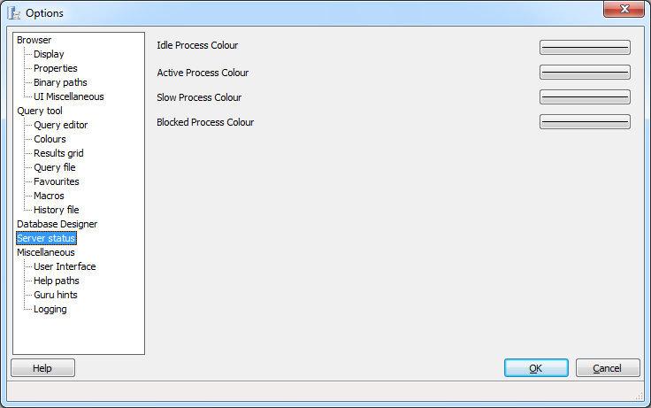

.. _options-server_status:

***************************************************************
`pgAdmin Server Status Options`:index:
***************************************************************

Use the options that are located under the *Server Status* node of the tree control to customize server status display preferences. 

Use the fields on the *Server Status* dialog to specify the colors displayed to indicate the status of a server:

* **Idle Process Colour** - Use the color selector to specify the display color of an idle process. A process is considered idle when the server is waiting for a new command.

* **Active Process Colour** - Use the color selector to specify the display color of an active process. A process is considered active when the server is executing a query.

* **Slow Process Colour** - Use the color selector to specify the display color of a slow process. A process is considered slow when a query exceeds 10 seconds.

* **Blocked Process Colour** - Use the color selector to specify the display color of a blocked process. A process is considered blocked an active query is waiting because of a lock.

