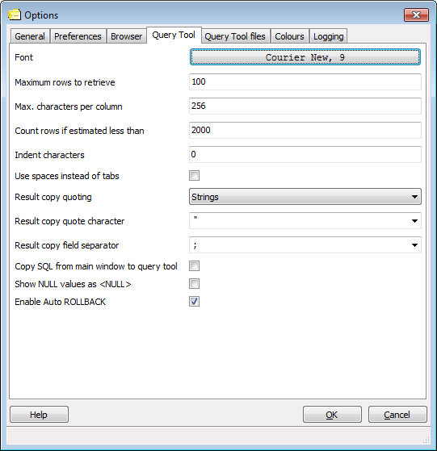

.. _options-tab4:

************************************
pgAdmin Options - Tab 4 (Query Tool)
************************************

* **Font** - This option allows you to select the font used in SQL Textboxes. This
  may be useful for countries with multibyte character sets where standard fonts may not
  display well.

* **Maximum rows to retrieve** - This option specifies the number of job and job step
  statistics rows to retrieve when viewing the statistics in the main browser. Unlike the
  statistics for other objects which normally consist of a fixed number of rows, a row is 
  created every time a job or job step is executed. The most recent statistics will be shown.
  

* **Max characters per column** - This option specifies the maximum 
  length of data displayed in a single column. 

* **Count rows if estimated less than** - In the object browser, if 
  the estimated number of rows in a table (as read from the table statistics) is 
  below this limit, a SELECT count(*) will be performed to find the exact value.

* **Indent characters** - This option specifies the number of characters
  to indent with in SQL text boxes.
  
* **Use spaces instead of tabs** - If checked, when you use the tab key in an SQL text 
  box, spaces will be inserted instead of the tab character.

* **Result copy quoting** - This option specifies how the fields should be quoted when
  copied to the clipboard from the result list. Quoting can be applied to string columns only
  (i.e. numeric columns will not be quoted) or all columns regardless of data type. Disabling 
  this option may prevent copying and pasting rows in the edit grid from functioning properly 
  if special characters like line breaks are involved.

* **Result copy quote character** - This option specifies which character should be used
  to quote the values when copied to the clipboard from the result list. It has no effect if 
  Result copy quoting is set to none.

* **Result copy field separator** - This option specifies which character should be used
  to separate the fields copied to the clipboard from the result list.

* **Copy SQL from main form to SQL dialogue** - When opening the Query 
  Tool, with this option selected, any object definition being displayed in the 
  main object browser will be inserted as a default query in the Query Tool.
   
* **Show NULL values as &lt;NULL&gt;** - This option will cause NULL values to be shown
  as &lt;NULL&gt; in the Query Tool's results grid. Note that this option does not affect data
  that is exported from the grid, only what is displayed.

