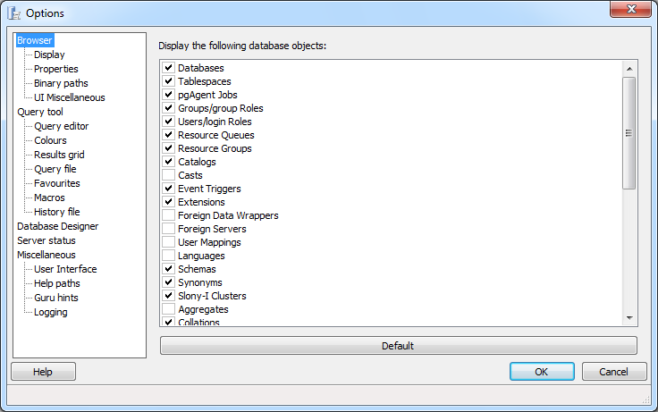

.. _options:

************************
`pgAdmin Options`:index:
************************

pgAdmin has a selection of configuration options that you can use to personalize your workspace.  pgAdmin is usually configured by using the *Options* dialog from within the pgAdmin application; to open the *Options* dialogue, select *Options* from the *File* menu.

The navigation panel on the *Options* dialog contains a tree control; each node of the tree control provides access to customizable options that are related to the selected node.  For information about the configurable options on each node of the pgAdmin tree control, please select from the links shown below.

Contents:

.. toctree::
   :maxdepth: 2

   options-browser
   options-query_tool
   options-database_designer
   options-server_status
   options-miscellaneous
   
   
