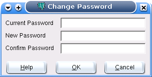

.. _password:

************************
`Change Password`:index:
************************

To change your password, follow the following steps:

#. Enter your current password in the *Current Password* textbox.
#. Enter your desired password in the *New Password* textbox.
#. Enter your desired password again, this time in the *Confirm Password* textbox.
#. Click the *OK* button.

Good practice
=============

It is good policy to set a password to protect your data, even in 'safe' environments such as at home. In
the workplace, failure to apply an appropriate password policy could leave you in breach of Data Protection
laws in some circumstances.

pgAdmin does not enforce any password restrictions, however we do recommend that you consider the following
guidelines when selecting passwords. This is not an exhaustive list and **will not guarantee security**.

* Ensure that passwords are of adequate length. 6 characters should be the absolute minimum.
* Ensure that passwords are not easily guessable by others, or open to dictionary attacks. Use a mixture of
  upper and lower case letters and numerics, and avoid using words or names. Consider using the first letter 
  from each word in a phrase that you will remember easily but others will not guess.
* Ensure that your password is change regularly - at least every ninety days.

