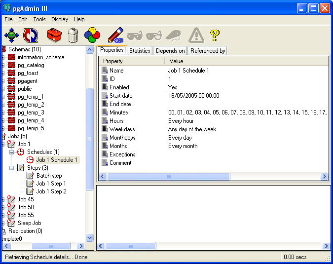
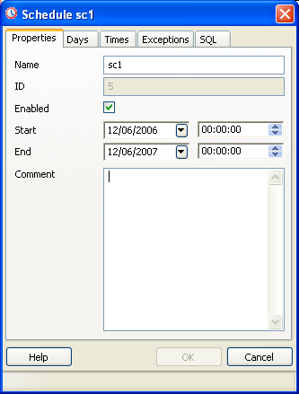
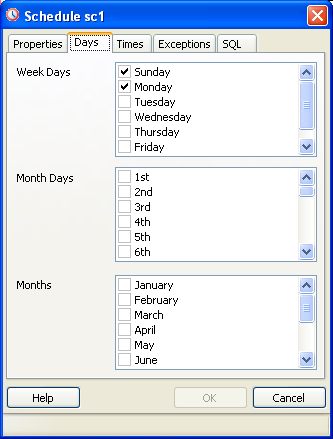
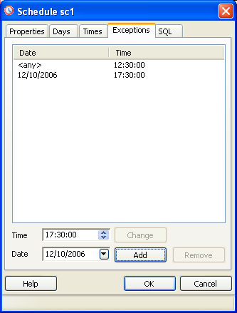

.. _pgagent-schedules:

**************************
`pgAgent Schedules`:index:
**************************

Each Job is executed according to one or more schedules. Each time the
job or any of its schedules are altered, the next runtime of the 
job is re-calculated. Each instance of pgAgent periodically polls the database
for jobs with the next runtime value in the past. By polling at least once 
every minute, all jobs will normally start within one minute of the specified
start time. If no pgAgent instance is running at the next runtime of a job,
it will run as soon as pgAgent is next started, following which it will return to 
the normal schedule.

Schedules may be added to a job through the job properties dialogue, or added
as a sub-object. The *Properties* tab of the main pgAdmin window will display 
details of the selected schedule.

Each schedule consists of the basic details such as a name, whether or not it
is enable and a comment. In addition, a start date and time is specified (before 
which the schedule has no effect), and optionally an end date and time (after
which the schedule has no effect).

Schedules are specified using a cron-style format. For each selected time or 
date element, the schedule will execute. For example, to execute at 5 minutes 
past every hour, simply tick '5' in the *Minutes* list box. Values from more than
one field may be specified in order to further control the schedule. For example, 
to execute at 12:05 and 14:05 every Monday and Thursday, you would tick minute 5,
hours 12 and 14, and weekdays Monday and Thursday. For additional flexibility,
the *Month Days* check list includes an extra *Last Day* option. This matches the
last day of the month, whether it happens to be the 28th, 29th, 30th or 31st.

On occasion it may be desirable to specify an exception for a schedule - for 
example, you may not want a schedule to fire on a particular national holiday.
To achieve this, each schedule may have a list of date and/or time exceptions
attached to it. If a schedule lands on an exception, that instance will be
skipped, and the following occurance will become the next runtime.

