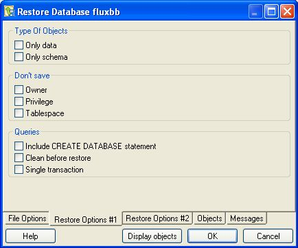
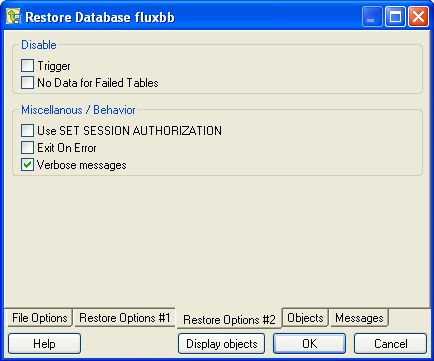
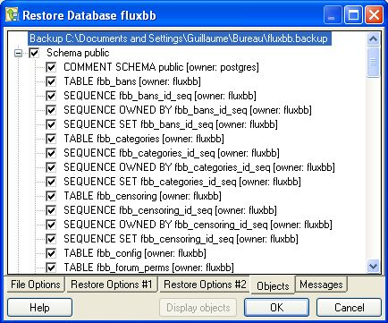

.. _restore:

****************
`Restore`:index:
****************

By selecting fields on the *Restore* dialog, you specify which options should be included in a customized `pg_restore <http://www.postgresql.org/docs/current/interactive/app-restore.html>`_ command.  The pg_restore command plays back an archive that recreates the database, database object, or data described by commands within the archive. 

If your archive is in a Custom, Tar, or Directory format, you can use the Restore dialog to restore from the archive.  If you have saved the backup in Plain format, use the psql client to restore.  

Please Note: If you are restoring into an existing database, you must ensure that any objects that might create conflicts because of pre-existing constraints or dependencies are dropped or truncated; use the *DROP CASCADE* or *TRUNCATE CASCADE* options on the context menu to clean up existing conflicts before performing a restore.

******************
The Restore Dialog
******************

To open the *Restore* dialog, right click on the name of an object in the tree control and select Restore from the context menu.  The *Restore* dialog opens:

.. image:: images/restore.png

Use the fields on the *File Options* tab to general information about the backup archive.  
* Use the *Format* field to select the file format of the archive you are restoring.  pgAdmin can restore from a Custom file (pg_dump format), a Tar file, or a Directory format file.  
* Use the *Filename* field to specify the name of the backup archive that will be used for the restore; optionally, use the file browser to navigate to and select the file.
* Use the *Number of Jobs* field to instruct the server to use multiple concurrent jobs for the restore.  The optimal value for this option depends on the hardware setup of the server, of the client, and of the network.  This option is supported only by the Custom and Directory archive formats.
* Use the *Rolename* field to specify the name of the role that will be used when invoking pg_restore.  

When you've completed the *File Options* tab, navigate to the *Restore Options #1* tab:

Use the fields on the *Restore Options #1* tab to specify details about the type of objects that will be restored.

* Use the checkboxes in the *Sections* box to select a portion of the object that will be restored.  By default, a restore will include all sections. 
 
  * Check the box next to *Pre-data* to include all data definition items not included in the data or post-data item lists.
  * Check the box next to *Data* to include actual table data, large-object contents, and sequence values. 
  * Check the box next to *Post-data* to include definitions of indexes, triggers, rules, and constraints other than validated check constraints. 

* Use the checkboxes in the *Type of Objects* box to select the objects that will be restored.  By default, all objects will be included.

  * Check the box next to *Only data* to restore only the data.
  * Check the box next to *Only schema* to restore only the schema (the data definitions). 

* Use the checkboxes in the *Don't Save* box to select the objects that will not be included.

  * Check the box next to *Owner* to omit commands that set object ownership.
  * Check the box next to *Privilege* to omit commands that create access privileges. 
  * Check the box next to *Tablespace* to omit tablespaces. 

When you've completed the *Restore Options #1* tab, select the *Restore Options #2* tab:

* Use the checkboxes in the *Queries* box to specify how the restore process should handle statements.

  * Check the box next to *Include CREATE DATABASE* statement to include a command in the backup that creates a new database when restoring from the backup.  
  * Check the box next to *Clean before restore* to instruct the server to drop an object before restoring it from the archive.  Please note that this option does not remove all dependencies for all objects; manual cleanup may be required before restoring into an existing database.
  * Check the box next to *Single transaction* to execute the restore as a single transaction; this ensures that all commands will complete successfully before the changes are applied.

* Use the checkboxes in the *Disable* box to specify trigger and table loading preferences.

  * Check the box next to *Trigger* (when creating a data-only backup) to include commands that will disable triggers on the target table while the data is being loaded.
  * Check the box next to *No Data for Failed Tables* to instruct pg_restore to not load table data if the create command for a table fails.  Specifying this option prevents duplicate or obsolete data from being loaded into an existing table.

* Use the checkboxes in the *Miscellaneous Behavior* box to specify additional restore options.

  * Check the box next to *Use SET SESSION AUTHORIZATION* to use SQL-standard SET SESSION AUTHORIZATION commands instead of ALTER OWNER commands to determine object ownership.
  * Check the box next to *Exit on Error* to exit the restore if an error is encountered while sending SQL commands to the database.
  * Check the box next to *Verbose messages* to instruct pg_restore to use verbose messages.

When you've completed the *Restore Options #2* tab, navigate to the Objects tab:

Click the *Display objects* button to populate the tree control on the *Objects* tab; when the list of objects is displayed, check the box to the left of an object name to include that object from the restore.

When you've completed the tabs, navigate to the *Messages* tab, and press *OK*.  

.. image:: images/restore-5.png

When the restoration completes, the *Messages* tab displays details about the restoration process:

If the restore was successful, the Messages tab will display:

	*Process returned exit code 0.*
	
If you receive an exit code other than 0, scroll through the *Messages* window to locate the problem; after correcting the problem, you can repeat the process.  

Scroll to the top of the Messages dialog to view the executed pg_restore command.  When you're finished, click *Done* to exit the *Restore* dialog.

