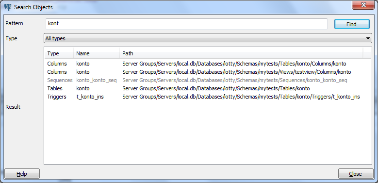

.. _search_object:

**********************
`Object search`:index:
**********************

With this dialog, you can search for almost any kind of objects in a
database.

You can access it by right clicking a database and select "Search objects"
or by hitting CTRL-G.

The minimum pattern length are 3 characters except for operators. The
search performed is non-case sensitive and will find all objets whose name
contains the pattern. You can only search for object names.

The result is presented in the grid with object type, object name and
the object tree path. You can click on a result row to select the object
in the :ref:`browser <main>`. If the object is grey, this means
that you don't have enabled those object types in the :ref:`Browser
settings <options-browser>`, so you can't click on it.
