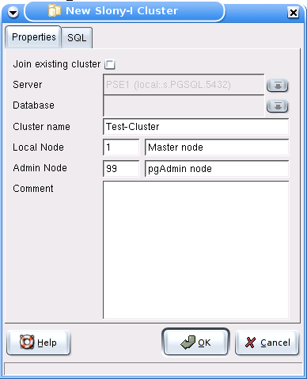
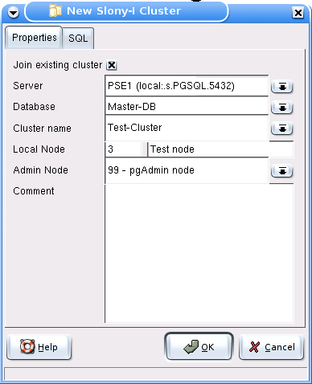
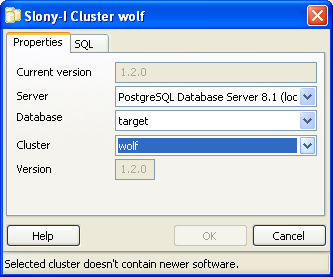

.. _slony-install:

**************************************************************
`Slony-I administration with pgAdmin III: installation`:index:
**************************************************************

.. _node:

Prerequisites
=============

As a prerequisite to running Slony-I on PostgreSQL, the slony modules 
xxid and slony1_funcs must be present on all servers that have to run a
Slony-I replication node. This is usually done by the Slony-I installation
routine. 

.. _overview:

Overview
========

Setting up Slony-I for the first time can be a daunting task. The
following sections of the pgAdmin helpfile will help guide you through
creation of your first cluster.

* :ref:`Step 1 <create>`: Create the cluster on the master node.
* :ref:`Step 2 <join>`: Add slave nodes to the cluster.
* :ref:`Step 3 <path>`: Setup paths on each node to all other nodes.
* :ref:`Step 4 <listen>`: Setup listens on each node to all other nodes
  (**Note**: Not required with Slony-I v1.1 or later).
* :ref:`Step 5 <set>`: Create a replication set.
* :ref:`Step 6 <table>`: Add tables and sequences to the set.
* :ref:`Step 7 <subscription>`: Subscribe the slaves to the set.

**Note** At this point, the slon daemons (service engines on Windows)
should be started.

.. _create:

Create cluster and first node
=============================

To install a Slony-I cluster on the first database, the "New Slony-I
Cluster" dialog is used. It executes the official Slony-I cluster
creation SQL scripts, which are located in the directory configured in
the :ref:`Options <options-browser>` dialog. 

pgAdmin III needs to store information how to contact each individual
node in the cluster. To achieve this, pgAdmin III uses the concept of
"Administrative nodes".

.. _join:

Join additional nodes to cluster
================================

After the first node in the Slony-I replication cluster has been
successfully created, all subsequent nodes take their configuration and
procedures from the first nodes. This process is called "Joining a
cluster" in pgAdmin III. Usually, you should also select an existing
node as admin node, to insure later accessibility from pgAdmin III.

After you added a new node to the Slony-I cluster, you need to set up 
:ref:`replication paths <slony-path>` between the nodes, to enable
communication between the nodes.

.. _upgrade:

Upgrade node to new cluster software
====================================

When a cluster is to be upgraded to a new version of the Slony-I
clustering software, the upgrade process has to be run on all nodes of
the cluster. For each node, the slon daemon needs to be stopped, then
the upgrade dialog is started and a node with the new software is
selected (pgAdmin III will extract all software from that node), and
finally the slon daemon is started again.

Currently, pgAdmin III does **not** support upgrading from slony creation
scripts. Instead, create an intermediate cluster from the creation
scripts, use it as a source for the upgrade dialog, and drop the cluster
after usage. You may also use the slonik tool to upgrade the first node,
and then use it as source for subsequent node upgrades.
