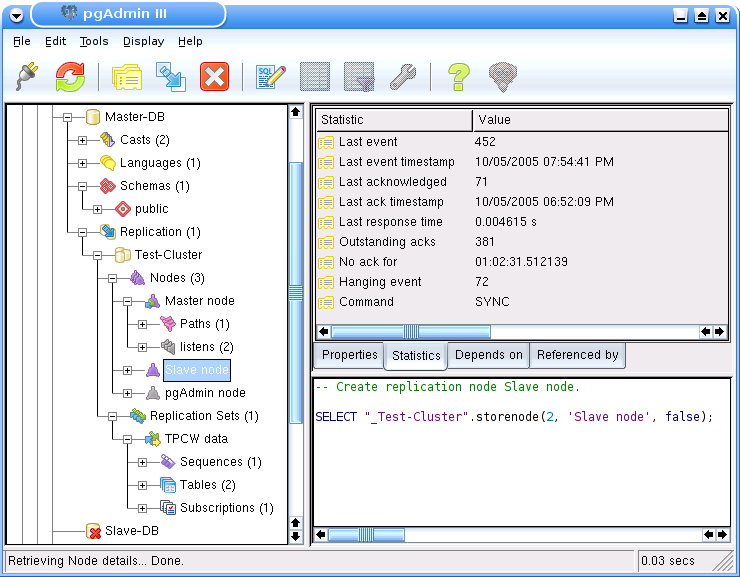

.. _slony-overview:

******************************************
`Slony-I with pgAdmin III overview`:index:
******************************************

The Slony-I objects are integrated into pgAdmin's main object tree browser, allowing
a single interface to both database object and replication administration.

The statistics tab for the nodes collection as well as for individual nodes show
the status of the replication event queue, and allows monitoring of the functionality
of the slony cluster.

As an example, the situation shown above displays the status of a node that hasn't 
been responsive for about an hour, with 381 events pending to be replicated to that
node.
