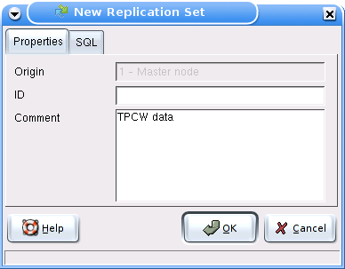
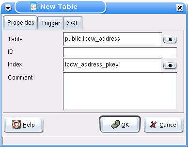
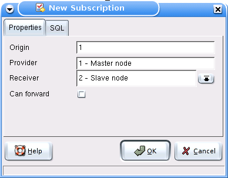

.. _slony-set:

****************************************
`Creating sets and subscriptions`:index:
****************************************

.. _set:

Create replication set
======================

Slony-I groups tables and sequences it has to replicate from a master to
slaves into replication sets. The set is created on the source node of
the data.

.. _table:

Define replicated table
=======================

If the source table has triggers defined on it, these have to be disabled
on replication target nodes. But in replication environments, the master
and slave roles might exchange, so it is necessary to enable and disable
triggers in those situations. The 'Trigger' page allows selection of
triggers that Slony-I should enable and disable if necessary.

**Attention:** If a table you'd like to have replicated doesn't appear
in the table combobox, this usually means that the table lacks a unique
index. Slony-I requires that each row in tables that are to be
replicated must be uniquely identifyable. Usually, this should be done
with a primary key, but for replication purposes a unique key is
satisfactory.

While Slony-I has a helper function to define intermediate unique keys,
this is not supported with tables added to replication sets with pgAdmin
III. We strongly recommend defining a primary key on the tables to be
replicated.

.. _sequence:

Define replicated sequence
==========================

.. image:: images/slony-sequence.png

The sequence allows adding sequences to a replication set.

.. _subscription:

Subscribe a replication set
===========================

After a replication set has been defined, it can be subscribed.
Subscriptions have to be created on the source node (note: on Slony-1
before v1.1, this had to be performed on the target node).

After a set has been subscribed, its table and sequence definition can't
be changed any more. To add more tables, you can create a set that
includes the additional tables and sequences you'd like to have added to
the first replication set, then subscribe exactly the same receiver nodes
to it, and finally use :ref:`Merge <slony-functions>` to merge both sets 
into one.
